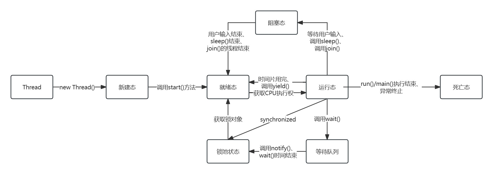
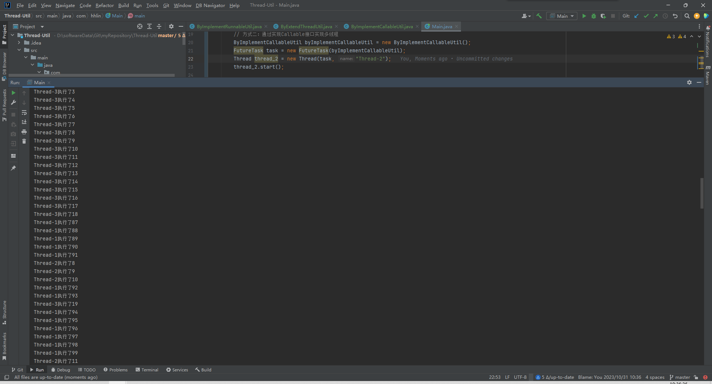

# 多线程demo

## 进程与线程
### 概述
- 进程是指正在运行的程序（驻留在内存中），是系统执行资源分配和调度的基本单位
- 线程是指进程中一个单一顺序的控制流，一个进程中可以并发多个线程，每个线程并行执行不同的任务
### 关系
- 一个进程包括由操作系统分配的内存空间，一个或多个线程；
- 一个线程不能独立存在，它必须是进程的一部分；
- 一个进程一直运行，直到所有非守护线程都结束运行才能结束

## 线程生命周期
### 线程状态
线程五种状态：
1. 新建状态：新建线程对象
2. 就绪状态：线程对象创建之后，其它线程调用了该线程对象的start()方法，就绪态的线程位于可运行线程池中，等待CPU执行权
3. 运行状态：就绪状态的线程获取了CPU执行权后，执行程序
4. 阻塞状态：由于某种原因放弃了CPU执行权，暂时停止，直到线程进入就绪态，才有机会转到运行态。线程阻塞情况有三种：
    - 等待阻塞：运行中的线程执行了wait()方法，JVM会将该线程放入等待池中（wait会释放持有的锁）
    - 同步阻塞：运行的线程在获取对象的同步锁时，若同步锁被其它线程占用，则JVM会将该线程放入锁池中
    - 其它阻塞：运行的线程执行了sleep()或join()方法，或发出了I/O请求，JVM会将该线程置为阻塞态，当sleep()超时、join()等待线程终止或超时、I/O处理完毕，线程会重新转入就绪态（sleep不会释放锁对象）
5. 死亡状态：线程执行完毕或异常原因退出了run()方法，该线程结束生命周期
### 线程状态转换

## 线程实现方式
### 实现方式一：继承Thread实现多线程
创建一个类，继承Thread父类，重写run()方法，创建该类对象，通过该对象开启线程
### 实现方式二：实现Callable接口实现多线程
1. 创建Callable接口实现类，并实现call()方法，call()方法将作为线程执行体，并且有返回值
2. 创建Callable接口实现类对象，使用FutureTask类包装Callable对象，FutureTask对象封装了该Callable对象的call()方法的返回值
3. 使用FutureTask对象作为Thread对象入参，由Thread对象开启线程
4. 调用FutureTask对象的get()方法，可以获取线程执行结束后的返回值
### 实现方式三：实现Runnable接口实现多线程
创建一个类，实现Runnable接口，重写run()方法，创建该接口实现类对象作为Thread对象的入参，通过Thread对象开启线程
### 区别
Thread与Runnable区别：
1. 继承Thread类与实现Runnable接口本质上都是实现了Runnable接口，但是继承了Thread类，无法再继承其它类
2. 继承Thread类，不适合资源共享；实现Runnable接口，容易实现资源共享

Runnable与Callable区别：
1. Runnable接口不返回任何内容，Callable接口可返回结果（核心区别）
2. Runnable接口中的run()方法异常只能内部处理，不能上抛；Callable接口的call()方法允许抛出异常
3. Runnable接口不能用于批量执行任务，Callable接口可以调用invokeAll()批量执行任务
4. Runnable可以作为Thread构造器的参数，通过开启新线程执行，也可以通过线程池执行；Callable只能通过线程池执行

## 运行示例
